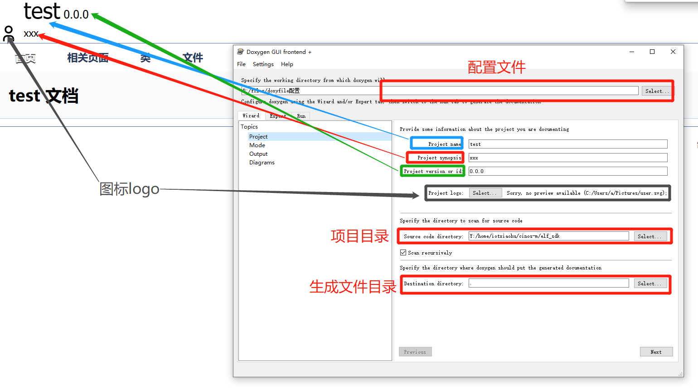
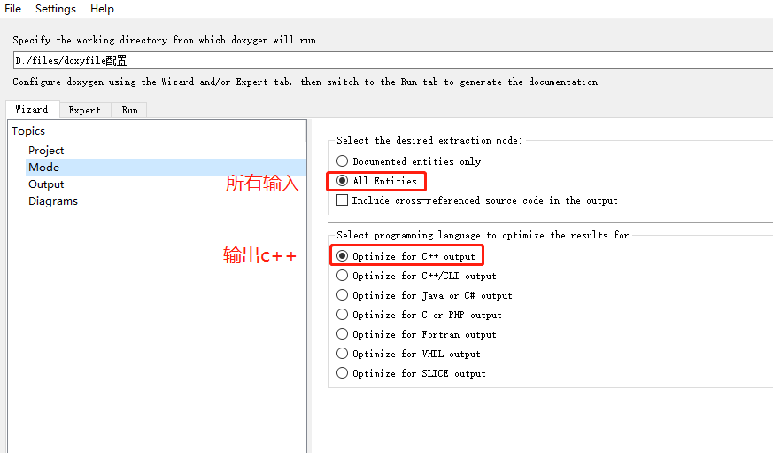
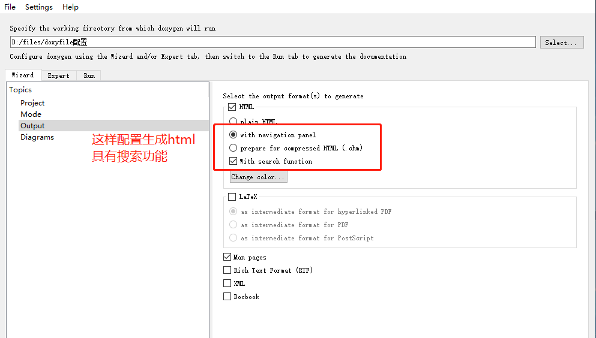
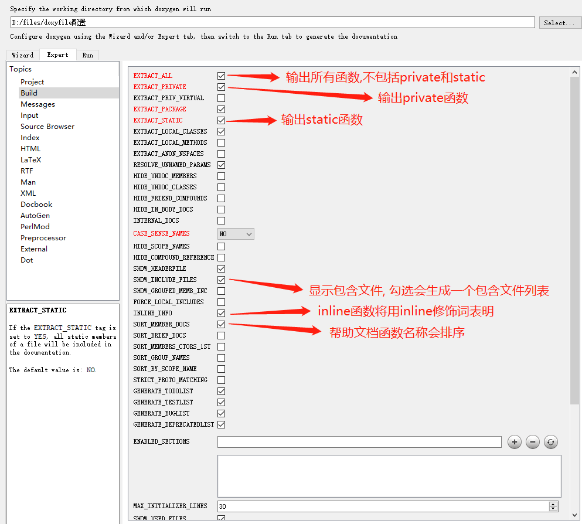
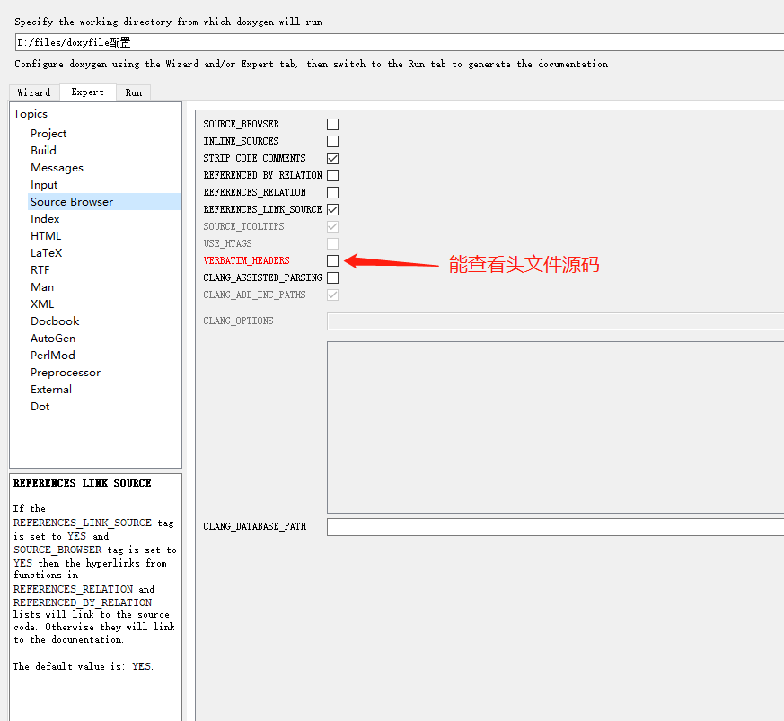

# doxywizard使用

<!--  -->

- `INPUT`               包含的目录
- `INPUT_ENCODING`      编码方式
- `FILE_PATTERNS`       要包含的文件
- `RECURSIVE`           是否递归查找文件
- `EXCLUDE`             需要排除的文件或者目录
- `EXCLUDE_SYMLINKS`    是否将符号链接排除
- `EXCLUDE_PATTERNS`    排除某些文件

[详细说明文档](https://www.doxygen.nl/manual/config.html)
