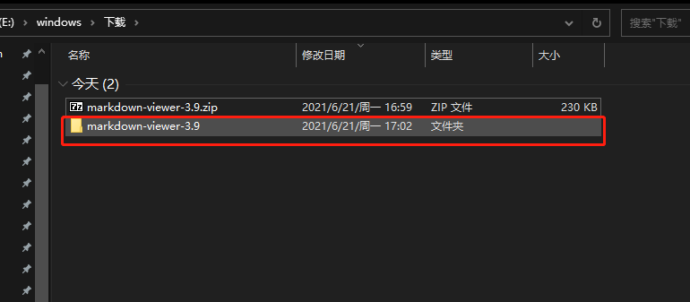
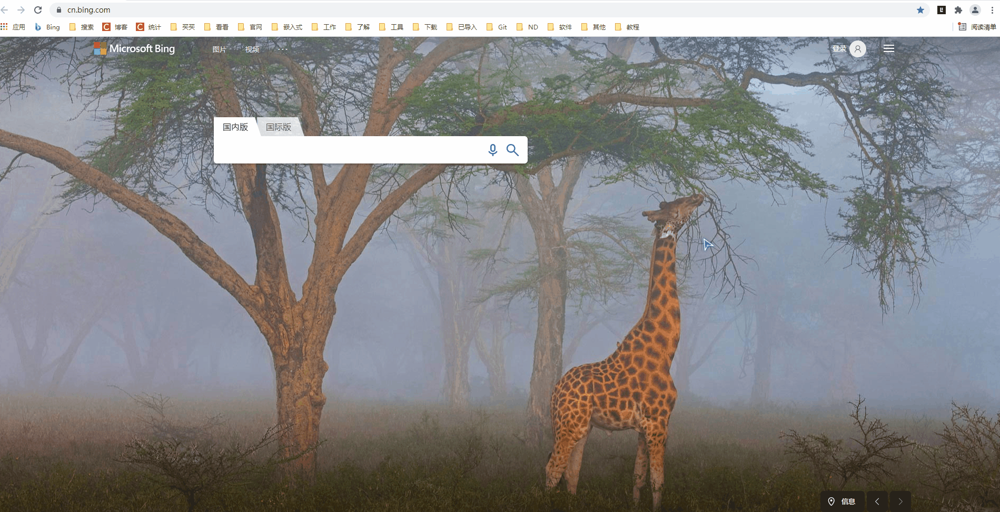
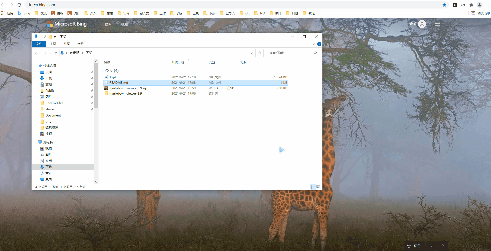

# 安装谷歌浏览器markdown插件

> `markdown` 文档是以 `.md` 结尾的文档, 如 `README.md`, 这儿我推荐谷歌插件 `markdown-viewer`, 可以直接在谷歌商城上面下载, 但是很多人访问不了, 这儿我推荐一种离线安装的方法.

---

## 下载插件 `markdown-viewer`

[点击下载](https://github.com/simov/markdown-viewer/archive/3.9.zip)

---

## 解压

- 如下图所示

---

## 谷歌浏览器导入插件

- 如下图所示

---

### 使用

- 使用的时候只需要拖到浏览器里面就行了或者直接设置打开凡事为浏览器, 然后双击就行了.

## 备注

---
