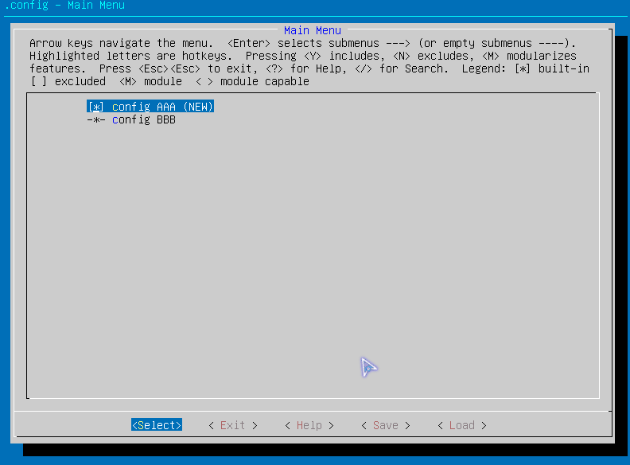

# menuconfig语法

<div align=center><a href="https://gitee.com/iotxiaohu/blog">
    
</a></div>

---

- 在 `Kconfig` 中定义的配置宏,前缀都没有 `CONFIG_` ,只有编译内核时,自动生成 `autoconf.h` 才会出现前缀.
- 如果 `XX_defconfig` 板卡配置文件中`定义新的宏=y` 时,而在 `Kconfig` 并没有声明它,则内核编译出来的 `autoconf.h` 里也不会定义它的.
- 如果 `XX_defconfig` 板卡配置文件中没有设置 `CONFIG_MODULES=y` 则编译make modules时将会失败,而 `make menuconfig` 时, `Kconfig` 中的 `tristate` 参数也会被读写为 `bool` 参数(也就是不能设置m)

| 名词         | 说明                                                            |
| ------------ | --------------------------------------------------------------- |
| `config`     | 一个选项                                                        |
| `default`    | 默认配置项                                                      |
| `help`       | help 提示信息专用                                               |
| `prompt`     | 提示信息                                                        |
| `comment`    | 相当于一行说明                                                  |
| `choice`     | 单选框, choice 中的 config 参数只能b ool 或 tristate            |
| `endchoice`  | 与 `choice` 配对使用                                            |
| `depends on` | 依赖项                                                          |
| `select`     | 反依赖项                                                        |
| `range`      | 数据范围 `range 0 100` 表述数据范围 0~100                       |
|              |                                                                 |
| `if`         | 判断                                                            |
| `endif`      | 与 `if` 配对使用                                                |
|              |                                                                 |
| `menu`       | 进入下个界面的菜单, 点击`Enter`键就能够进入这个menu所对应的界面 |
| `endmenu`    | 与menu配对使用                                                  |
| `menuconfig` | 可选的菜单，先择它，它就相当于成了                              |
|              |                                                                 |

## 类型

| 类型       |                           |
| ---------- | ------------------------- |
| `bool`     | y -- 默认选中             |
|            | n -- 默认不选             |
| `tristate` | y -- 将驱动编译进内核镜像 |
|            | n -- 不编译               |
|            | m -- 将驱动编译为ko形式   |
| `string`   | 普通字符串类型            |
| `hex`      | 十六进制形式              |
| `int`      | 十进制整数                |

- prompt 配置项的提示
- default 表示默认值

## 基本的类型

```Kconfig
config AAA
    bool "config AAA"
    default y
config BB
    int "config BB"
    default 123
config CC
    string "config CC"
    default 123
config DD
    hex "config DD"
    default 0x123
config EE
    tristate "config EE"
    default y
```

- 因为我的 `tristate` 没有启用, 所以为默认为了 `bool` 类型


备注 : 如果 `退格` 不能删除 请使用 `Ctrl + 退格`

---

## menu

```Kconfig
menu "this is menu info"
comment "*** menu config ***"
config AAA
    bool "config AAA"
    default y
config BBB
    bool "config BBB"
    default n
config CCC
    bool "config CCC"
    default n
endmenu
```


---

## menuconfig

```Kconfig
comment "*** menuconfig config ***"
menuconfig AAA
    bool "using AAA"
if AAA
config BBB
    bool "using BBB"
    default y
endif
```


---

## select

```Kconfig
config AAA
    bool "config AAA"
    select BBB          # AAA 被选中后, BBB 也被选中
    default y
config BBB
    bool "config BBB"
    default y
```



---

## depends

```Kconfig
config XXX
    bool "config XXX"
    default y
config YYY
    bool "config YYY"
    depends on XXX      # 表示依赖, XXX 被选中 才会有 YYY
    default y
```


---

## choice

```Kconfig
choice
    prompt "choice entry"       # 作为该单选框入口点的标签
    default y
    default AAA                 # 默认选择 AAA 配置项

config AAA
    bool "config AAA"
    help
        AAA help info
config BBB
    bool "config BBB"
    help
        BBB help info
config CCC
    bool "config CCC"
    help
        CCC help info

endchoice
```


---

## 引用其他文件的 Kconfig

- `dir/Kconfig` 文件内容

```Kconfig
config AAA
    bool "config AAA"
    select BBB          # AAA 被选中后, BBB 也被选中
    default y
config BBB
    bool "config BBB"
    default y
```

- `./Kconfig` 文件内容

```Kconfig
source service/elog/Kconfig
```


---
